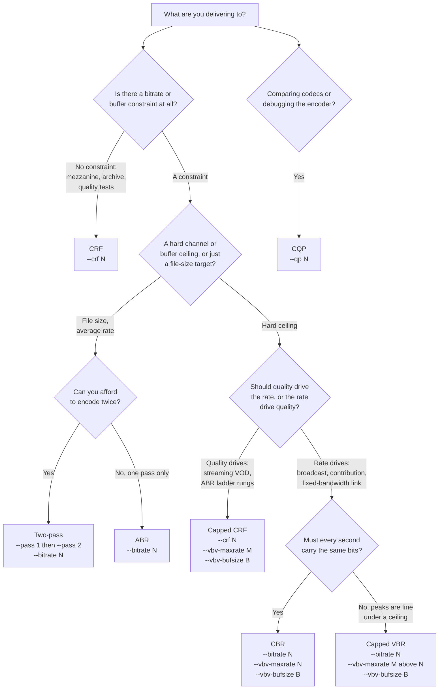
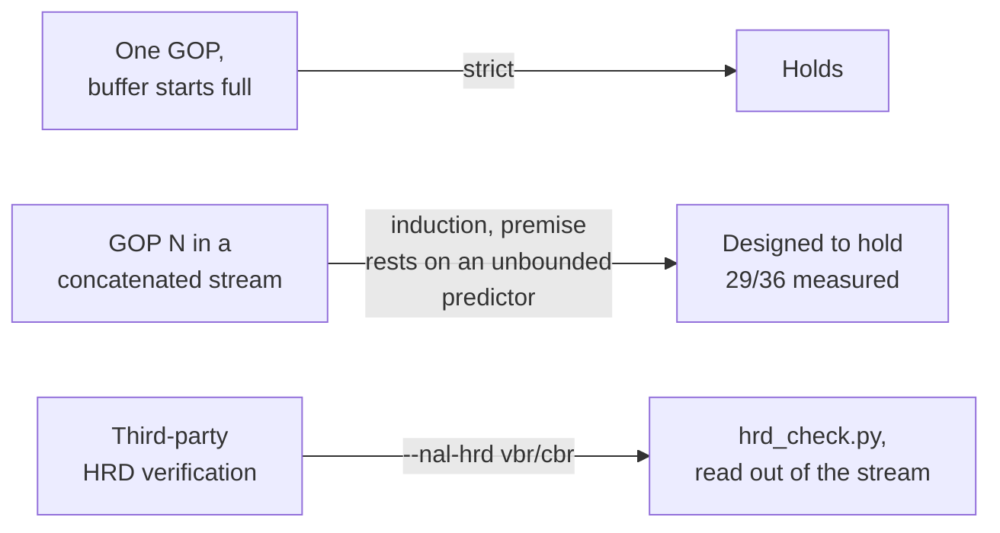

# Rate control in yah264

Which rate-control mode you want is a question about what you are delivering
to, not about which one is best. A mezzanine file, a chunked ABR ladder, a
fixed-bandwidth contribution link and a codec experiment want four different
answers, and three of those four are wrong for the other three jobs.

This guide covers what each mode is for, what it will and will not promise, and
the places where yah264 differs from x264 in ways that will surprise you. For
the bare flag list see [options.md](options.md).

The corpus behind the measurements quoted here is six to eleven clips at CIF and
720p, except the equal-CRF section, which is fifteen from CIF to 4K. Where this
file and the code disagree, the code wins.

## Contents

- [Picking a mode](#picking-a-mode)
- [The modes at a glance](#the-modes-at-a-glance)
- [CQP](#cqp-constant-quantiser)
- [CRF](#crf-constant-rate-factor)
- [CRF numbers against x264](#crf-numbers-against-x264)
- [ABR](#abr-single-pass-average-bitrate)
- [CBR and capped VBR](#cbr-and-capped-vbr)
- [Capped CRF, which is what VOD wants](#capped-crf-which-is-what-vod-wants)
- [Two-pass](#two-pass)
- [What VBV actually guarantees](#what-vbv-actually-guarantees)
- [Determinism](#determinism)
- [Silent failures](#silent-failures)

## Picking a mode



If you are here because you just want a good file and nothing is constraining
you, the answer is `--crf`, and then read the two CRF sections below before you
pick the number, because both of them will cost you time if you skip them.

## The modes at a glance

| Mode | Flags | Optimises | Promises | Cannot promise |
| --- | --- | --- | --- | --- |
| CQP | `--qp N` | nothing; it is an instrument | a fixed quantiser | any rate. ±7% is the best case, and it misses by +12% / -9% on real clips |
| CRF | `--crf N` | constant perceived quality | consistent quality across the clip | a rate. Only a discrete ladder of rates is reachable |
| ABR | `--bitrate N` | hitting an average | tight rate accuracy: within +3.3% worst case measured | quality consistency, or any buffer behaviour |
| CBR | `--bitrate N --vbv-maxrate N --vbv-bufsize B` | a flat delivery rate | rate within +3.4% and buffer compliance | good quality on hard content; it has nowhere to put peaks |
| Capped VBR | `--bitrate N --vbv-maxrate M --vbv-bufsize B` | average rate with headroom | the average, plus buffer compliance | that the peak is never approached |
| Capped CRF | `--crf N --vbv-maxrate M --vbv-bufsize B` | quality, bounded by a buffer | CRF quality where the cap is slack, cap compliance where it is not | a predictable file size |
| Two-pass | `--pass 1` then `--pass 2 --bitrate N` | bit distribution across the whole clip | the target rate, and better quality than ABR at that rate on every corpus clip | anything about a live workload; it needs the whole clip twice |

**`--qp`, `--bitrate` and `--crf` each name a mode, and the last one on the
command line wins**, as in x264. A warning on stderr names the flag that lost.
`--pass` is outside that contest: it is a mode plus a stats round-trip whose
target is `--bitrate`, and a `--crf` passed alongside it is dropped with a
message.

## CQP, constant quantiser

Every frame gets the QP you named, modified only by the frame-type cascade and
mb-tree. There is no feedback of any kind.

Reach for it when you are measuring something and want the rate controller out
of the way: codec comparisons at fixed QP, bisecting an encoder bug, checking
byte-identity between two builds. It is not a delivery mode. On the corpus it
misses a target rate by +12% (bus) and -9% (park_joy), and even in principle the
integer QP grid means about ±7% is the best it can do.

**yah264's `--qp` is not x264's `--qp`.** x264's parameter validation forces
both mb-tree and AQ off whenever the RC method is CQP. yah264's mb-tree gate
has no rate-control term in it at all, so mb-tree
keeps running and keeps moving QP around per macroblock. AQ does get zeroed, but
by the CLI rather than the library: `aq_strength` defaults to 0 when
`rc.method == 0`. So a head-to-head `--qp 26` run compares two different
workloads, and the comparison flatters neither encoder honestly. The project's
own harness sets `Y264_MBTREE_OFF=1` on every CQP row for this reason and
labels it, so it is never silent.

## CRF, constant rate factor

The mode for anything where quality matters more than an exact size: masters,
mezzanines, archives, personal encodes, and the base of most quality work. The
encoder picks a QP per frame from a rate factor plus mb-tree's per-macroblock
offsets, with no bits feedback anywhere. It is open loop by design.

### The integer staircase

**`rc_set_qp_crf` ends in `e->qp = (int)lround(qp)`.** The rate factor is a
float all the way down and then lands on an integer QP. Two consequences you
will hit within the first hour:

**Fractional CRF is accepted and largely inert.** `--crf 21.8`, `--crf 21.9` and
`--crf 22.0` all produced 416 kbit/s on foreman_cif. `--crf 22.1` and
`--crf 22.3` both produced 362. The CLI parses tenths and stores them, they just
mostly do not survive the rounding.

**Only a ladder of rates about 13% apart is reachable.** A worst-case target
sits half a step away, so **CRF cannot be solved to an arbitrary bitrate at all**
and the miss can be 6-7% of rate. In the mode-matrix bisection, bus_cif could
not get within 4.8% of its target and stefan_cif could not get within 5.3%,
after exhausting the search. x264 by comparison moves about 1.4% of rate per 0.1
of CRF, effectively continuous.

If you are building a tool that searches for a CRF to hit a rate, search on a
grid of 1.0, not 0.1. A 0.1 grid oscillates between plateaus and does not
converge; it took 7 encodes without converging where x264 took 3.

### What CRF costs you here

*2026-09-03: this section and the equal-CRF table below were measured before
`Y264_CRF_CPLX` became the default, and that term is what narrows the spread.
Read both as historical. The equal-CRF half was re-measured on 2026-09-16 and
the answer changed; see [the next section](#crf-numbers-against-x264). The VMAF
paragraph directly below has not been re-measured.*

At matched bitrate, yah264's CRF scores **1.3 to 3.5 VMAF below x264 on five of
six clips**. That is worth stating precisely, because it is *not* a coding
efficiency deficit: yah264 is ahead of x264 medium by -2.76% BD-rate overall.
It is a CRF-specific allocation problem, and it is open. If you are benchmarking
this encoder against another one, ABR is the fairer mode, and the project's own
comparison tables keep both.

## CRF numbers against x264

**`--crf N` means about what it means on x264: aligned as measured, to a median
0.4-0.8 of a CRF point, with a per-clip spread of roughly plus or minus 1.7
points.** Type the CRF number you would have typed there and you get a file of
about the size you expected. Do not expect the two to agree clip by clip, and do
not use an equal-CRF pair as a matched operating point for a quality comparison
-- that is what the last paragraph here is about.

Measured 2026-09-16, default preset on both sides against `--preset medium`,
default threads, 120 frames (48 at 4K), CRF 18/22/26/30/34, fifteen clips from
CIF to 4K. The number in each cell is **the x264 CRF whose file size matches
ours**, minus the CRF we were asked for: `+1.0` means our `--crf 26` produced
the bytes x264's `--crf 27` produces, i.e. we came out *smaller*. The last
column is the same fact as a size ratio at one point.

| Clip | crf 18 | crf 22 | crf 26 | crf 30 | crf 34 | size vs x264 at crf 26 |
| --- | ---: | ---: | ---: | ---: | ---: | ---: |
| akiyo_cif | +0.37 | +0.55 | +0.58 | +0.89 | +1.27 | -6.7% |
| bus_cif | +0.39 | +0.15 | -0.02 | +0.02 | +0.16 | +0.2% |
| coastguard_cif | +1.06 | +1.02 | +1.02 | +0.93 | +0.90 | -16.7% |
| foreman_cif | +0.23 | +0.16 | +0.30 | +0.62 | +1.03 | -3.5% |
| mobile_cif | +1.01 | +1.09 | +1.18 | +1.38 | +1.30 | -17.0% |
| stefan_cif | +0.14 | +0.02 | -0.07 | -0.06 | +0.18 | +1.0% |
| tempete_cif | +0.83 | +0.86 | +1.00 | +1.37 | +1.79 | -14.3% |
| ducks_720p | +0.81 | +0.70 | +0.75 | +0.95 | +1.25 | -10.6% |
| fourpeople_720p | -0.13 | -0.30 | -0.37 | -0.13 | +0.13 | +5.2% |
| park_joy_720p | -0.10 | -0.30 | -0.43 | -0.44 | -0.32 | +7.1% |
| sintel_720p | -1.68 | -1.08 | -0.52 | -0.35 | -0.10 | +6.9% |
| crowd_run_1080p | +0.39 | -0.19 | -0.28 | -0.16 | +0.12 | +4.0% |
| pedestrian_1080p | +0.26 | -0.29 | -0.60 | -0.86 | -1.00 | +8.4% |
| 4K segment A | +0.74 | +1.21 | +1.13 | +0.28 | -0.60 | -14.4% |
| 4K segment B | +1.42 | +1.77 | +1.72 | +1.38 | +0.76 | -23.2% |

| | crf 18 | crf 22 | crf 26 | crf 30 | crf 34 |
| --- | ---: | ---: | ---: | ---: | ---: |
| median offset | +0.39 | +0.16 | +0.30 | +0.28 | +0.18 |
| median absolute offset | 0.39 | 0.55 | 0.58 | 0.62 | 0.76 |
| spread across clips | 3.10 | 2.85 | 2.31 | 2.25 | 2.79 |

The two 4K rows are 48-frame segments of **one** source taken at two different
offsets, and they disagree by 0.6 to 0.7 of a CRF point at every rung. That is
the whole finding about the spread in one line: it is content, and a single
source contains enough of it to move the number by most of a point.

**The level is aligned and the residual is not an offset problem.** The median
offset is flat in CRF (+0.16 to +0.39 across the whole range), so there is no
level error to correct and no slope error either. The residual changes sign
between clips at the same CRF -- tempete_cif +1.79 against pedestrian_1080p
-1.00 at CRF 34 -- so no remapping of the CRF number, of any shape, can shrink
it: every clip moves together. What is left is the two encoders' bit allocation
differing by content, which is a coding-efficiency difference wearing a CRF
number's clothes, and it is measured as BD-rate rather than as a scale.

Two alternatives were priced on the same fifteen clips and both are worse, which
is why nothing changed here:

| Arm | median abs offset | spread |
| --- | ---: | ---: |
| shipped default | 0.39-0.76 | 2.25-3.10 |
| `Y264_CRF_CPLX=0` | 1.52-1.93 | 5.01-5.44 |
| `--aq-strength 1.0` | 0.73-0.86 | 1.70-3.84 |

So the complexity term is what buys the alignment, and it buys nearly all of it:
without it the scale sits a point and a half off with three times the spread,
which is the state the historical table below describes. Raising AQ strength to
the value x264 uses moves the level away and widens the spread; the shipped 0.4
is defended on BD-rate elsewhere and is also the better number here.

The mechanism, unchanged from the earlier finding: under mb-tree, x264's CRF
base QP is a fixed pedestal with no content term at all, and all of its content
adaptation lives in the DC of its AQ field. yah264's mb-tree offsets subtract
the frame mean, so their DC is exactly zero on every clip, and the content
adaptation x264 gets for free is absent. `Y264_CRF_CPLX` is the behaviour-match
for those terms; it ships on, and `Y264_CRF_CPLX=0` turns it off. See
[the env section](#rate-control-env-gates).

### How it used to read, and why the old table is still here

*Before `Y264_CRF_CPLX` shipped on by default.* At CRF 25 over 120 frames,
yah264's file size against x264's at the same CRF ranged from **-54.6% to
+45.3%** across eleven clips:

| Clip | Size vs x264 at equal CRF |
| --- | --- |
| ducks | +45.3% |
| park_joy | +29.7% |
| mobile | +18.0% |
| bus | +12.3% |
| tempete | +6.4% |
| coastguard | +1.5% |
| stefan | -0.4% |
| foreman | -9.1% |
| samsung | -29.6% |
| akiyo | -31.2% |
| sintel | -54.6% |

That is a 100-point spread that changes sign, and the advice that went with it
was that no offset could fix it. The same two extremes now read ducks -10.6% and
sintel +6.9%, and the whole set spans 32 points at CRF 26 rather than 100. Keep
the old table when reading anything published before 2026-09-16: it is the
regime those numbers were taken in.

**Equal CRF is still not a matched operating point.** A 32-point size spread is
narrow enough to type a CRF number into, and far too wide to compare quality
across. At equal CRF the two encoders sit at different places on their own RD
curves, so a dVMAF or dPSNR column measured there is reading the size gap, not
an efficiency difference.

**What to do for a comparison:** compare on achieved bitrate, not on CRF. The repo has
`scripts/crf-solve.py`, which runs a secant on log(rate) versus CRF in two or
three encodes a side. It solves **yah264 first**, lets it land on whichever
rung it can actually reach, and then solves x264 onto that achieved rate, rather
than imposing a round number on both. Matched rates come out within -1.7% to
+0.6%. Results cache in `tests/.crfcache`; drive it with `make parity-status-crf`
or `PARITY_RC=crf`.

## ABR, single-pass average bitrate

One pass, an integrator chasing an average. Use it when you need a predictable
file size in one pass and cannot afford two, and when nothing downstream cares
about the shape of the buffer.

Rate accuracy is this encoder's strongest rate-control result. Across 15 cells
the mean absolute rate error was **1.50%** (ref1/bf2) and **1.53%** (ref3/bf3),
worst case within +3.3%. x264 on the same cells averaged **7.16%** and **7.43%**
and missed by as much as -14.4%. Delivered rate is also invariant to thread
count: foreman at 2500 kbit/s delivered 2495.4 and 2495.2 kbit/s across 1, 4, 8
and 18 threads.

What it does not do is distribute bits well over a long clip. An integrator only
knows the past, so a hard section arriving late in a clip is paid for by
whatever quality is left. That is the entire argument for two-pass.

One rough edge: **low-bitrate encodes are slow.** At the low operating point
yah264 loses 1.22x (stefan), 1.25x (bus) and 1.44x (park_joy 720p) to x264,
while matching or beating it at the high point. The cause is late skip
decisions: 26.5% of P and 46.6% of B macroblocks run a full ME plus intra plus
RD and are then coded as skip. A byte-identical skip oracle bounds the available
win at 1.19-1.40x, which covers the whole deficit, so this is a sized gap rather
than a mystery.

## CBR and capped VBR

Both are ABR with a VBV attached. The difference is only where you put the cap.

**CBR** is `--bitrate N --vbv-maxrate N --vbv-bufsize B`, cap equal to target.
For a fixed-bandwidth link that will not tolerate a peak: contribution feeds,
some broadcast profiles, hardware decoders with a small buffer. Add
`--nal-hrd cbr` when the receiver has to be able to CHECK that, rather than
believe it; it declares the constant schedule and pads every access unit up to
it with filler. yah264 held
within +3.4% of target on all six clips and was VBV-clean on all six. x264 on
the same cells missed by as much as -23.2%, which is why five of those six
comparison cells are recorded as unmatched.

**Capped VBR** is `--bitrate N --vbv-maxrate M --vbv-bufsize B` with `M > N`,
typically 1.5x to 2x. It hits average while letting hard scenes borrow up to
the cap. This is the traditional VOD mode, and it is a reasonable choice, but
for most streaming work capped CRF below is the better tool.

The compliance gate, `scripts/cvbr_compliance.sh`, last read 29 of its 36 cells
clean on 2026-09-03. Read it for what it is: it drives each clip at a CRF with a
cap rather than at a bitrate, so it never exercises the ABR path, and the cells
it does cover are a tendency on this corpus rather than a guarantee.

**`--vbv-maxrate` without `--vbv-bufsize` silently disables VBV.** Both are
required; neither warns. Check your stderr line and your output size.

## Capped CRF, which is what VOD wants

```sh
yah264 --input-y4m in.y4m --crf 21 --vbv-maxrate 6000 --vbv-bufsize 12000 -o out.264
```

Quality-targeted but buffer-bounded. Easy content codes at CRF 21 and comes out
small; hard content runs into the ceiling and gets bounded instead of blowing
the buffer. For streaming VOD and for the rungs of an ABR ladder this is almost
always the mode you want, because it lets the easy titles be cheap without
letting any title be undeliverable.

Mechanically it is one-sided by design. CRF sets the quality, and the VBV
budget can only ever *take bits away*, never add them. So where the cap is slack
your encode is exactly the CRF encode you asked for, bit for bit. Where it is
tight, a per-frame budget aimed at a target buffer fill pulls the buffer back
toward half full. Above half full that budget is generous; below it
the budget collapses to half of one frame's arrival, so the buffer climbs back
at a bounded rate. With that budget in place the compliance gate passes 29 of
its 36 cells (2026-09-03; it read 34 of 36 when this was written).

That budget is the piece that makes the mode work at all, and it is worth
knowing why. Under CRF nothing else in the encoder looks at bits. The fit test
alone only fires once the buffer is nearly empty, so without the budget a rate
factor whose natural bitrate sits above the cap drains the buffer from full to
empty completely unopposed, and the encode then runs pinned at the boundary
where every prediction error is an underflow. The tighter the cap, the worse
that gets.

Two things to plan around:

- **Multi-GOP encodes pay for composability.** Every GOP after the first assumes
 it inherits a half-full buffer rather than a full one, which is what makes
 concatenated segments safe. It costs bits: park_joy and ducks gave up 6.7-7.3%
 of their bits and 1.18-2.75 VMAF-NEG, in exchange for delivered rate moving
 from 9.6-13.1% over cap down to 2.2-5.2% over.
- **Short keyints run hot.** Rate sits about 11% over cap at `--keyint 30`
 against about 7% at `--keyint 250`, because the bits model resets per GOP even
 though the buffer no longer does. If you are cutting two-second segments,
 expect to aim the cap low.

## Two-pass

Pass 1 analyses and writes a stats file, pass 2 plans the whole clip against it.

```sh
yah264 --input-y4m in.y4m --pass 1 --bitrate 4000 --stats clip.stats -o /dev/null
yah264 --input-y4m in.y4m --pass 2 --bitrate 4000 --stats clip.stats -o out.264
```

Use it whenever you have the whole file up front and a rate target you must hit:
VOD encodes, catalogue work, anything where you can spend the machine time. Do
not use it for live, obviously, and do not use it if a capped CRF would have
been the honest answer to your delivery constraint.

The offline allocator gives the anchor frame the bits it needs: on foreman at
400 kbit/s the I/P/B bytes come out at 14202/3933/772, so the I frame carries
about 18x a B frame.

Measured as BD-VMAF-NEG against yah264's own single-pass ABR at matched rate,
so lower is better and negative means two-pass wins:

| Clip | BD-VMAF-NEG vs one-pass ABR |
| --- | --- |
| foreman_cif | **-14.04%** |
| bus_cif | **-2.28%** |
| stefan_cif | **-2.36%** |
| samsung_720p | **-35.66%** |
| park_joy_720p | **-2.40%** |
| ducks_720p | **-1.61%** |
| sintel_720p | **-33.63%** |

**Every clip beats one-pass ABR, on all seven and not merely on average.** Rate
accuracy is within 0.8%. This is on by default; `Y264_TP_PLAN=0` selects the
ranking allocator instead, which gives the I frame the *highest* QP in its GOP
and is much worse.

**Two-pass threads in both passes**, and ships on, running 1.8-3.0x off x264.
Wall-clock speedups for pass 1 plus pass 2 together against the serial path:
foreman 3.7x, bus 3.5x, stefan 3.1x, samsung 5.0x, park_joy 8.0x, ducks 8.2x.
The speedup tracks GOP count, so short single-GOP clips gain only what the row
wavefront gives them.

Practical notes:

- The stats file carries GOP boundary markers (`#gop index first end records`)
 so pass 2 can split it per worker. They are comments, so one file also feeds
 the serial whole-stream reader.
- **Pass 2 only threads if pass 1 was threaded**, because a serial pass 1 writes
 no markers to split on. It silently falls back to serial, correctly.
- **Do not change `--frames` or `--keyint` between passes.** Pass 2 checks the
 markers against the split it computed and exits with a message rather than
 applying positional stats to the wrong frames.
- Single-GOP clips are byte-identical to the serial two-pass. Multi-GOP clips
 differ by about 0.2% in size, because the feedback does not cross the GOP
 boundary on the threaded path. That is the one behavioural consequence of
 threading it.
- **Pass 1 is a full-effort encode**, CQP 26 at full medium analysis. x264 cuts
 subme and partitions in pass 1 unless you ask for `--slow-firstpass`. Pass 1 is
 close to half the total wall, so a cheap-first-pass option is worth roughly
 another 1.7x. It does not exist.

## What VBV actually guarantees

Stated precisely, because the two halves of this are genuinely different in
strength.

**Per segment, from a full buffer: this holds, and it is strict.** Every GOP is
independently decodable and legal against a buffer that starts full, and GOPs
after the first assume only half of one. For chunked delivery, ABR ladders and
anything where each segment is fetched and decoded on its own, that is the
guarantee that matters, and it is the one you have.

**Per stream, concatenated end to end: designed to hold, measured to hold on 29
of 36 gate cells, not proved.** The induction is sound, but its premise is that
each segment exits at or above the handoff occupancy, and that rests on the rate
loop returning to its fixed point. The loop is driven by a predictor whose error
tail is unbounded, and there is no device in this design that turns an unbounded
prediction error into a bounded buffer excursion. Do not read that count as a
proof; read it as evidence.

The paragraph below decomposes the 34-of-36 run of 2026-08, the last one whose
failures were attributed. x264 passes the same gate 18 of 18. The two failing
cells there are one clip
(samsung at 480 kbit/s, on both code paths) and the mechanism is an unpromoted
scene cut: frames 110-113 code at 288-920 bits each, then frame 114 lands at
347,960 bits, 21.7 times the per-frame rate. No predictive clamp catches that.

**The buffer model can now be written into the stream: `--nal-hrd vbr|cbr`.**
Without it the compliance check is a check against the encoder's own buffer
model and nothing else, so a receiver has to take your intended buffer on trust.
With it the SPS carries `hrd_parameters`, every IDR carries a
`buffering_period` SEI and every picture a `pic_timing`, and the schedule is
third-party verifiable: `scripts/hrd_check.py` reads it back out of the stream
and simulates Annex C without being told anything on the command line.

Two things to know about what that declaration is worth.

**It declares the model the rate control obeys, not a wider one.** `BitRate` and
`CpbSize` are `--vbv-maxrate` and `--vbv-bufsize` rounded up onto the syntax's
own grid (64 bit/s and 16 bits), and the initial `cpb_removal_delay` is the
occupancy the encoder started from -- full for a stream that starts the output,
the handoff level for a segment that follows one. Nothing is widened to make the
check pass.

**The two ledgers count different bytes, and the difference is real.** The rate
control steers on a picture's slice bits; a receiver's buffer holds every byte
of the access unit, start codes, parameter sets, SEI and filler included. That
gap is roughly 20-40 bytes per access unit, about 2.5% of a frame at 400 kbit/s
and proportionally less above it, and the rate control does not budget for it.
On a cell with headroom this is invisible. On a cell already running at the
boundary it is not, and it is the rate control's to close, not the signalling's.

`vbr` moves no sample and no slice bit: the pictures are the ones the same VBV
encode already produced, and the recon is identical. `cbr` adds filler and
nothing else.



## Determinism

**Same input, same config, same thread count gives the same output, bit for
bit.** That holds and is gated in CI.

Output **may** differ across different thread counts. The stronger
thread-count-invariant guarantee is deliberately not offered: it costs more in
unreachable multi-thread throughput than it is worth, and x264 does not offer it
either (at CRF 25 on park_joy, all four md5s across {asm, noasm} x {1, 18
threads} differ). If you need reproducibility across machines with different
core counts, pin `--threads` to the same number everywhere.

Rate accuracy itself is thread-invariant in ABR, as the foreman numbers above
show, even where the bitstream is not.

## Rate-control env gates

The rate-control-relevant environment variables. The full catalogue, including
the internal ones, is in [options.md](options.md#environment-variables).

| Variable | Default | Effect |
| --- | --- | --- |
| `Y264_TP_PLAN` | 1 (on) | The two-pass offline allocator. 0 selects the ranking allocator instead, which is much worse. |
| `Y264_2PASS_MT` | 1 (on) | Threaded two-pass. 0 forces the serial path exactly. |
| `Y264_CRF_CPLX` | 1 (on) | CRF complexity term, and the reason `--crf N` costs about what it costs on x264 (2026-09-16, fifteen clips: median offset 0.4-0.8 of a CRF point with it, 1.5-1.9 without). Improves 9 of 12 clips on BD-VMAF-NEG; it still regresses samsung +9.30% and touchdown +10.71%, and 0 turns it off. |
| `Y264_CRF_FPS` | follows `Y264_CRF_CPLX`, so on | Frame-duration term, so CRF N means the same operating point at 24 and 50 fps. A correctness fix rather than a tuning one, 9 of 12 clips neutral or better. |
| `Y264_MBTREE_OFF` | 0 (off) | Applies x264's CQP policy of disabling mb-tree. The harness sets this on CQP rows so the comparison is like for like. |

## Silent failures

Every one of these produces a plausible-looking encode rather than an error.

- **`--vbv-maxrate` without `--vbv-bufsize` turns VBV off** with no diagnostic.
 Both are needed.
- **`--pass 2` with a missing or empty stats file** codes every frame at base QP
 26, which looks exactly like a CQP encode that happened to come out at the
 wrong size. A *mismatched* stats file is caught and exits with a message on the
 threaded path; a missing one is not.
- **Fractional CRF** is accepted, stored, and then mostly rounded away.
- **A capped-CRF encode with a short keyint** will sit meaningfully over its cap
 rather than warn you.

Naming two rate-control modes is not one of these: the loser is dropped with a
warning on stderr, as described under [Picking a mode](#picking-a-mode).
